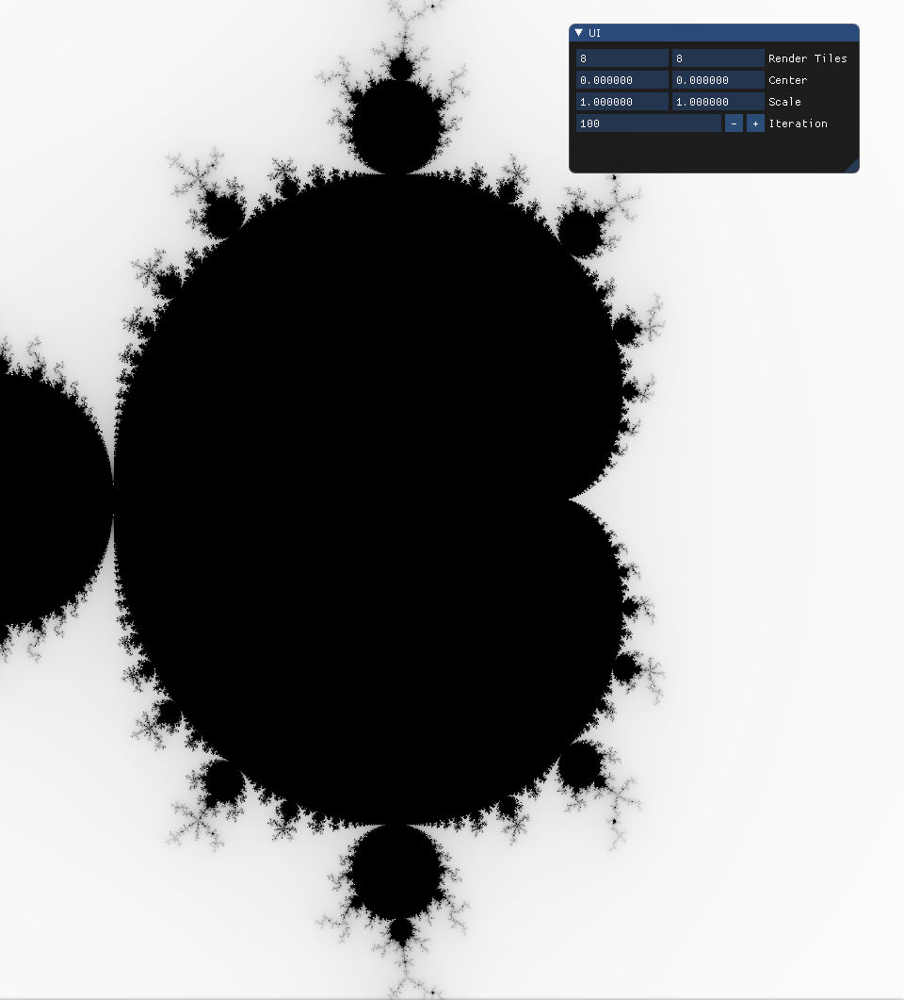

# Mandelbrot Viewer



Mandelbrot Viewer with ImGui written in C++.

## Build
```
mkdir build
cd build
cmake ..
make -j2
```

## Run
```
./main
```

## Externals
* [glfw](https://github.com/glfw/glfw) - Zlib License.
* [Dear ImGui](https://github.com/ocornut/imgui) - MIT License.
* [ThreadPool](https://github.com/progschj/ThreadPool) - Zlib License.